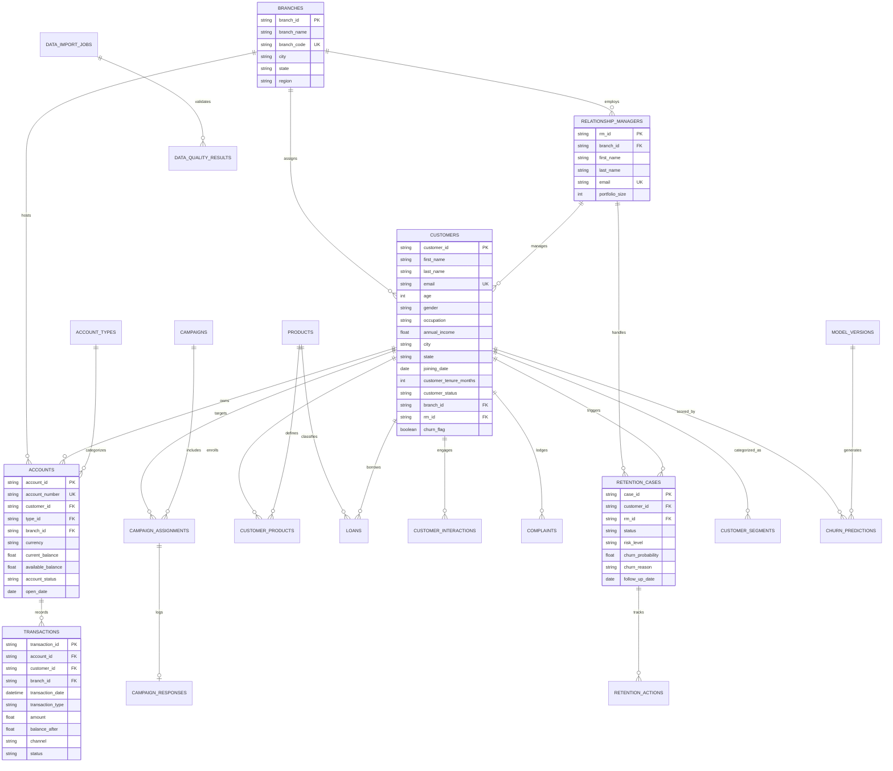

# BankSight Entity Relationship Diagram (ERD)
## Normalized Relational Banking Data Model
**Document Version:** 1.0.0  
**Date:** 2026-11-07  

---

```mermaid
erDiagram
    BRANCHES ||--o{ RELATIONSHIP_MANAGERS : employs
    BRANCHES ||--o{ CUSTOMERS : assigns
    BRANCHES ||--o{ ACCOUNTS : hosts
    RELATIONSHIP_MANAGERS ||--o{ CUSTOMERS : manages
    RELATIONSHIP_MANAGERS ||--o{ RETENTION_CASES : handles

    CUSTOMERS ||--o{ ACCOUNTS : owns
    ACCOUNT_TYPES ||--o{ ACCOUNTS : categorizes
    ACCOUNTS ||--o{ TRANSACTIONS : records

    CUSTOMERS ||--o{ CUSTOMER_PRODUCTS : enrolls
    PRODUCTS ||--o{ CUSTOMER_PRODUCTS : defines
    PRODUCTS ||--o{ LOANS : classifies
    CUSTOMERS ||--o{ LOANS : borrows

    CUSTOMERS ||--o{ CUSTOMER_INTERACTIONS : engages
    CUSTOMERS ||--o{ COMPLAINTS : lodges
    CUSTOMERS ||--o{ CAMPAIGN_ASSIGNMENTS : targets
    CAMPAIGNS ||--o{ CAMPAIGN_ASSIGNMENTS : includes
    CAMPAIGN_ASSIGNMENTS ||--o| CAMPAIGN_RESPONSES : logs

    CUSTOMERS ||--o{ CUSTOMER_SEGMENTS : categorized_as
    CUSTOMERS ||--o{ CHURN_PREDICTIONS : scored_by
    MODEL_VERSIONS ||--o{ CHURN_PREDICTIONS : generates

    CUSTOMERS ||--o{ RETENTION_CASES : triggers
    RETENTION_CASES ||--o{ RETENTION_ACTIONS : tracks

    DATA_IMPORT_JOBS ||--o{ DATA_QUALITY_RESULTS : validates

    BRANCHES {
        string branch_id PK
        string branch_name
        string branch_code UK
        string city
        string state
        string region
    }

    RELATIONSHIP_MANAGERS {
        string rm_id PK
        string branch_id FK
        string first_name
        string last_name
        string email UK
        int portfolio_size
    }

    CUSTOMERS {
        string customer_id PK
        string first_name
        string last_name
        string email UK
        int age
        string gender
        string occupation
        float annual_income
        string city
        string state
        date joining_date
        int customer_tenure_months
        string customer_status
        string branch_id FK
        string rm_id FK
        boolean churn_flag
    }

    ACCOUNTS {
        string account_id PK
        string account_number UK
        string customer_id FK
        string type_id FK
        string branch_id FK
        string currency
        float current_balance
        float available_balance
        string account_status
        date open_date
    }

    TRANSACTIONS {
        string transaction_id PK
        string account_id FK
        string customer_id FK
        string branch_id FK
        datetime transaction_date
        string transaction_type
        float amount
        float balance_after
        string channel
        string status
    }

    RETENTION_CASES {
        string case_id PK
        string customer_id FK
        string rm_id FK
        string status
        string risk_level
        float churn_probability
        string churn_reason
        date follow_up_date
    }
```
